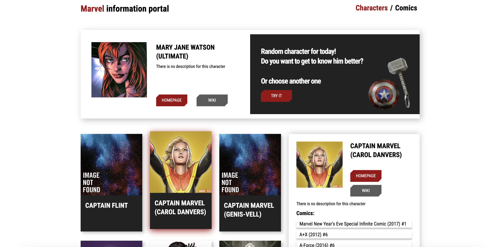

# Интерактивное приложение с персонажами комиксов Marvel

## Превью:


## Запуск проекта:
* Склонировать проект на ваш компьютер с Github с помощью команды:
```
https://github.com/ShaidullovMarsel/Marvel_React.git
```

* Установить зависимости с помощью команды:
```
npm i
```
* Запустить проект с помощью команды:
```
npm start
```
